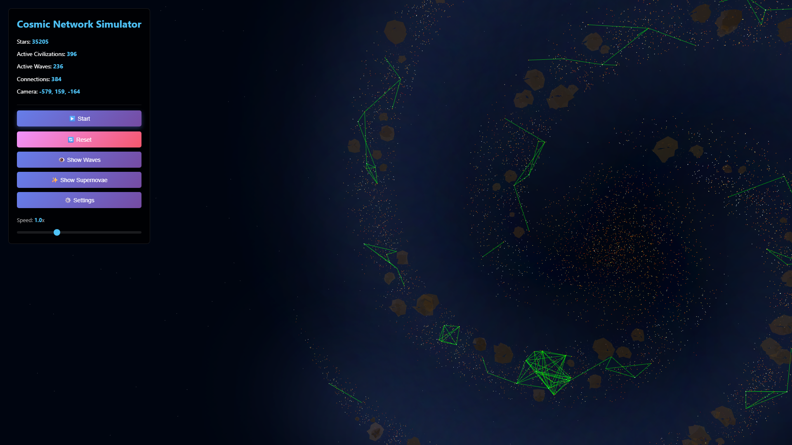

# 🌌 Cosmic Network Simulator

A real-time 3D visualization of galactic civilizations emerging and connecting through radio wave communication across three spiral galaxies containing tens of thousands of stars.



## ✨ Features

- **Three Distinct Galaxies**: Middle-aged 3-arm spiral, old 2-arm tight spiral, and young 4-arm loose spiral, each with unique characteristics and positioned in 3D space
- **Dynamic Civilization Emergence**: Stars randomly develop intelligent life based on configurable probability (0.05% per frame)
- **Radio Wave Propagation**: Visual expanding radio waves emitted from active civilizations (max 30 units radius)
- **Automatic Network Formation**: Connections form via two-way handshake when both stars have been active long enough for light-speed round-trip communication
- **Spiral Arm Glow**: Subtle luminous effect along galaxy spiral arms using additive blending
- **Dust Cloud Obscuration**: Interstellar dust blocks radio signals and dims starlight
- **Star Lifecycle**: Stars age, fade, and die (60-180 sec lifetime) with rare supernova events (0.05% chance at death)
- **Low-Rate Star Birth**: New stars spawn at 10% replacement rate, allowing simulation to eventually end
- **Fully Configurable**: 50+ parameters adjustable via in-app settings UI
- **Performance Optimized**: Handles tens of thousands of stars with spatial partitioning (O(n) collision detection)

## 🚀 Quick Start

### Prerequisites

- Node.js 16+ and npm

### Installation

```bash
# Clone the repository
git clone https://github.com/yourusername/CosmicNetworkSim1.git
cd CosmicNetworkSim1

# Install dependencies
npm install

# Start development server
npm run dev
```

The app will open at `http://localhost:3000`

### Build for Production

```bash
npm run build
npm run preview
```

## 🎮 Controls

- **Mouse Drag**: Rotate camera view
- **Mouse Wheel**: Zoom in/out
- **▶️ Play/Pause**: Start/stop simulation
- **🔄 Reset**: Restart with saved settings
- **⚙️ Settings**: Configure all simulation parameters
- **👁️ Toggle Waves**: Show/hide radio wave visualization
- **✨ Toggle Supernovae**: Enable/disable flash effects
- **Speed Slider**: Adjust simulation time scale (0.1x - 3.0x)

## ⚙️ Configuration

All simulation parameters are configurable via the Settings UI:

- **Star Behavior**: Activation/deactivation probabilities
- **Galaxy Structure**: Disk size, spiral arm curvature, central bulge
- **Active Star Visuals**: Size, brightness, light intensity
- **Dust Obscuration**: Opacity levels for different obscuration types
- **Radio Waves**: Speed, radius, color, opacity
- **Network Formation**: Maximum connection distance
- **Star Birth**: Replacement ratios and population thresholds

Settings persist in browser localStorage.

## 🏗️ Architecture

```
src/
├── main.ts              # Application entry point, scene setup
├── networkManager.ts    # Galaxy generation, simulation state
├── entities.ts          # Star, RadioWave, Connection, DustCloud classes
├── settings.ts          # Configuration management
├── armGlow.ts           # Spiral arm glow effects
├── spatialGrid.ts       # Spatial partitioning for performance
└── styles.css          # UI styling
```

### Key Technologies

- **Three.js**: 3D rendering and scene management
- **TypeScript**: Type-safe development
- **Vite**: Fast build tooling with HMR
- **ESLint**: Code quality and consistency

### Performance Features

- **Spatial Partitioning**: O(n²) → O(n) for wave/dust/connection checks using grid-based spatial hashing
- **Smart Connection Logic**: Two-way handshake timing eliminates need for wave intersection testing
- **Dynamic Lighting**: Only active stars emit point lights (~99.5% reduction, only active civilizations)
- **Static Dust Clouds**: 270 clouds with no movement calculations
- **Resource Management**: Proper Three.js geometry/material disposal prevents memory leaks

## 🧪 Development

```bash
# Run linter
npm run lint

# Auto-fix linting issues
npm run lint:fix

# Type check
npm run build
```

## 📊 Statistics Display

Real-time metrics shown in UI:
- Total stars across all galaxies
- Currently active civilizations (with "ended" indicator)
- Active radio waves propagating
- Network connections established

## 🤝 Contributing

Contributions welcome! Please feel free to submit a Pull Request.

## 📝 License

This project is licensed under the MIT License - see the [LICENSE](LICENSE) file for details.

## 🎯 Roadmap

- [ ] Add unit tests (Vitest)
- [ ] GitHub Actions CI/CD
- [ ] Code coverage reporting
- [ ] Interactive tutorial/onboarding
- [ ] Export simulation data (JSON/CSV)
- [ ] More galaxy types (elliptical, irregular)
- [ ] Custom galaxy designer
- [ ] Time-lapse recording

## 🐛 Known Issues

- Performance may degrade with very large star counts (>40K) on lower-end hardware
- Spiral arm glow uses additive blending which may appear dim on some displays
- Star death can cause brief frame drops when removing many stars simultaneously

## 👏 Acknowledgments

Built with inspiration from the Fermi Paradox and SETI research.

---

**Made with ❤️ and Three.js**
